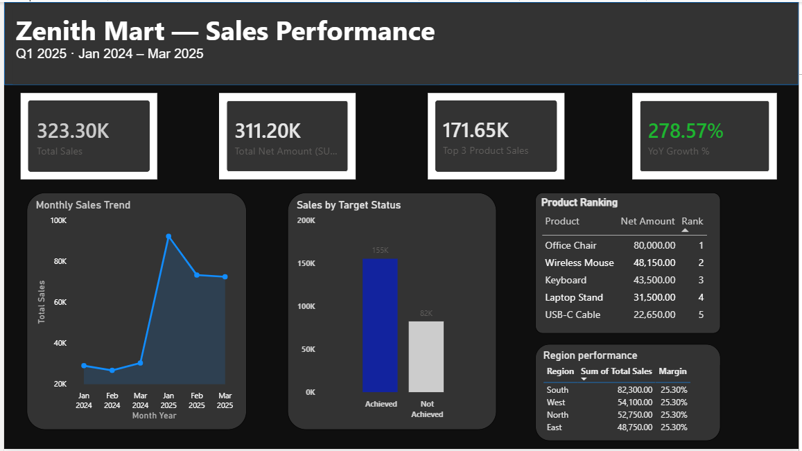

# Zenith Mart — Q1 2025 Sales Analytics Dashboard

A Power BI dashboard analyzing multi-year retail sales performance for a
fictional retailer, Zenith Mart. Built end-to-end from raw transactional
CSV/Excel exports using Power Query for data preparation and DAX for
analytics — including time intelligence, product ranking, and dynamic
Top-N reporting.

## Dashboard Preview

## What This Project Covers

**Data preparation (Power Query)**
- Combined monthly sales files from a folder into a single table
- Merged product master, returns, and regional target data
- Appended a second year of sales data (2024 + 2025) into one unified table
- Resolved real data quality issues: stale calculated columns, missing
  dimension records (product master gaps), join key mismatches, and
  column-name collisions using a coalesce pattern in the Advanced Editor

**Data modeling & DAX**
- Built a Calendar table and connected it properly for time intelligence
- Time intelligence measures: YTD Sales (`TOTALYTD`, `DATESYTD`), Previous
  Month/Quarter/Year Sales (`DATEADD`, `SAMEPERIODLASTYEAR`), MoM Growth %,
  YoY Growth %
- Row context vs. filter context: `SUMX`-based iterator measures to validate
  and correct a stale stored column
- Product ranking with `RANKX`, including Skip vs. Dense tie-handling
- Reusable Top-N analysis using `TOPN` + `CALCULATE` (rather than
  visual-level or built-in Top N filters) so results can be reused across
  cards and visuals

**Dashboard design**
- Restructured from a raw "verification workbench" into a presentable,
  single-page dashboard
- Dark theme with consistent card styling, KPI row, and grouped visuals
- Region filter as a clean dropdown slicer

## Key Learnings / Debugging Notes

- Time-intelligence functions require the **Calendar table's** date column
  on the visual axis — using a fact table's date column instead silently
  returns blank or incorrect results.
- Two fact tables joined only through a shared dimension do **not**
  automatically filter each other — this caused flat/repeated totals until
  the relationship was fixed.
- A blank or repeated value in a `RANKX` or `SUMX` result is often a signal
  to check upstream data quality (missing dimension rows, stale columns),
  not a DAX bug.
- `DIVIDE`'s third argument handles blank denominators gracefully — safer
  than a raw `/` for ratio measures.

## Tools

Power BI Desktop · Power Query (M) · DAX

## Source Data

Raw source files are in `/data`. These include the core sales, product,
and returns files used to build this dashboard, along with some
additional practice files from related data-cleaning exercises.

## Files

| File | Description |
|---|---|
| `ZenithMart_Q1_2025_Sales.pbix` | Full Power BI project file |
| `screenshots/dashboard_overview.png` | Dashboard preview image |
| `docs/` | Learning notes covering the DAX/Power Query concepts used in this project |
| `data/` | Contains the all csv files  used |
